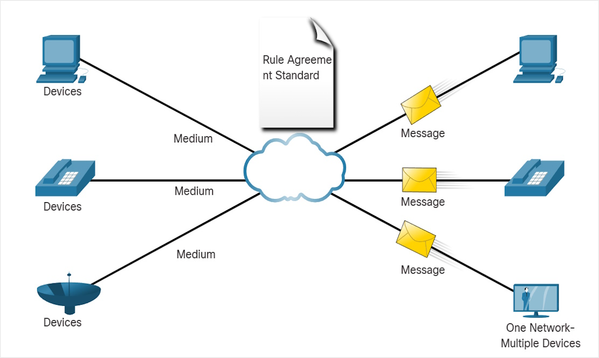

# Internetkapcsolat

## Internet-hozzáférési technológiák

### Otthoni és kisvállalati internetkapcsolatok

Gyakori típusai:

| Angol név | Magyar név  | Média        | leggyakoribb szolgáltató | megjegyzés                                     |
|-----------|-------------|--------------|--------------------------|------------------------------------------------|
| Dial-up   | betárcsázós | telefonvonal | Invitel                  | elavult                                        |
| DSL       |             | telefonvonal | Telekom (?)              | Digital Subscriber Line                        |
| Cable     | kábeles     | coax         | Vodafone                 | [DOCSIS](https://hu.wikipedia.org/wiki/DOCSIS) |
| Satellite | műholdas    | mikrohullám  | Starlink (?)             |                                                |
| Fiber     | optikai     | optikai szál | DIGI                     |                                                |

#### Optikai infrastruktúra típúsai *(Fiber to the x)*

- *FTTH*, Fiber To The Home
  **pl.:** az optikai szál eléri a lakótér határát, például egy doboz a ház külső falán
- *FTTB*, Fiber To The (Building/Business)
  **pl.:** az optikai szál eléri az épület határát, például a pincét egy többlakásos egységben, és a végső csatlakozást az egyes lakóterekhez alternatív módon van megoldva
- **[Többiek](https://en.wikipedia.org/wiki/Fiber_to_the_x)**

#### DSL infrastruktúria típusai

- *ADSL*, Assymatric Digital Subscriber Line
  - a legelterjedtebb DSL-típus. Gyorsabb letöltési sebességet tesz lehetővé, mint feltöltési sebességet.

- *SDSL*, Symmetric Digital Subscriber Line
  - a feltöltési és letöltési sebesség egyenlő

- *VDSL*, Very-high-bit-rate Digital Subscriber Line
  - nagyobb sebességű DSL, főleg kisebb távolságokon

- *HDSL*, High-bit-rate Digital Subscriber Line
  - T1 (1544 Kbit/s) vagy E1 (2048 Kbit/s) sebességű DSL

### Vállalati internetkapcsolatok

| Angol név              | Magyar név            | Média        | megjegyzés                                                                  |
|------------------------|-----------------------|--------------|-----------------------------------------------------------------------------|
| Dedicated Leased Lines | Dedikált bérelt vonal |              | a szolgáltató hálózatának fenntartott vonala                                |
| Metro Ethernet         |                       | rézkábel     | Ethernet WAN - LAN hozzáférési technológiákkal valósít meg WAN-t            |
| Üzleti DSL             | Business DSL          | telefonvonal | A legnépszerűbb változat az SDSL                                            |
| Satellite              | Műholdas              | mikrohullám  | Műholdas szolgáltatást ott is lehet nyújtani, ahol vezetékes megoldás nincs |

### A konvergáló hálózat

A konvergáló hálózatok lehetővé teszik, hogy a hagyományos telefonhálózatokat, az internetet és más szolgáltatásokat egyetlen hálózaton keresztül használják.

| Hagyományos különálló hálózat                | Konvergált hálózat                  |
|----------------------------------------------|-------------------------------------|
| több szolgáltatás fut több hálózaton         | több szolgáltatás fut egy hálózaton |
|  |    |

