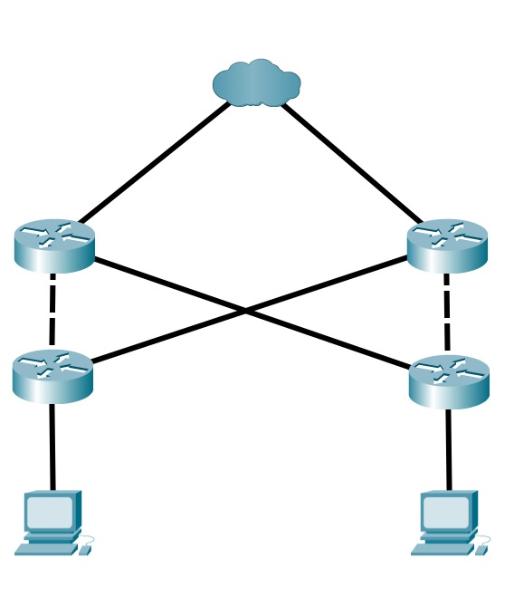

# Megbízható hálózatok

## Hálózati architektúrák

### Alapvető célok

- Hibatűrés
- Megbízhatóság
- QoS, Quality of Service
- Biztonság

## Hibatűrés

### Hibatűrő, csomagkapcsolt hálózat példája

A redundáns kapcsolatok alternatív útvonalakat tesznek lehetővé, ha egy eszköz vagy egy kapcsolat meghibásodik. A felhasználói élményt ez nem befolyásolja.

*Egy hibatűrő hálózat* hiba előfordulása esetén **minimalizálni tudja az érintett eszközök számát**. A hiba után **gyors helyreállítást** tesz lehetővé. Az ilyen hálózatok azon alapulnak, hogy az üzenet forrása és a célja között több útvonal is létezik. Ha egy útvonal megszakad, az üzeneteket azonnal egy másik kapcsolaton továbbítják. *Redundanciának* hívják azt, amikor egy célállomáshoz több út is vezet.

A csomagkapcsolt hálózatok megvalósítása a *redundancia* érdekében a megbízható hálózatokban az üzenetek, például e-mailek vagy videofolyamok csomagokra való felosztását jelenti. **Minden csomag címzési információt tartalmaz**, és függetlenül kerül továbbításra. A hálózati útválasztók a **hálózat állapota alapján irányítják** a csomagokat, lehetővé téve, hogy az üzenetek különböző útvonalakon jussanak el ugyanahhoz a célállomáshoz. A kapcsolat megszakadása esetén a routerek *automatikusan*, a felhasználó beavatkozása nélkül átirányítják a csomagokat, így biztosítva a kommunikáció zavartalanságát.

## Skálázhatóság

A skálázható hálózat **gyorsan befogadja az új felhasználókat** és alkalmazásokat **anélkül, hogy a meglévő felhasználók szolgáltatásait befolyásolná**. A szabványok és protokollok betartásával a tervezők lehetővé teszik az új hálózatok zökkenőmentes integrációját.

## Szolgáltatásminőség *(QoS)*

Egy QoS-házirenddel konfigurált router képes az adat- és hangforgalom kezelésére úgy, hogy a fontosabb, valós idejű adatokat előnyben részesíti a kevésbé fontos adatokkal szemben. A QoS lehetővé teszi a hálózatok számára, hogy a különböző alkalmazásokat különböző prioritással kezeljék.

## Hálózatbiztonság

### Alappillérek

#### Bizalmasság

Az adatok bizalmas kezelése azt jelenti, hogy csak a kívánt és jogosult személyek férnek hozzá és olvashatják az adatokat.

**pl.:** titkosítás

#### Adatintegritás

Az adatintegritás (adatok épsége) azt jelenti, hogy garantálható, hogy az információt a forrástól a célig tartó átvitel közben nem módosították.

**pl.:** hash függvények

#### Elérhetőség

Az elérhetőség azt jelenti, hogy a jogosult felhasználók naprakészen és megbízható módon férnek hozzá az adatokhoz.

**pl.:** redundancia
